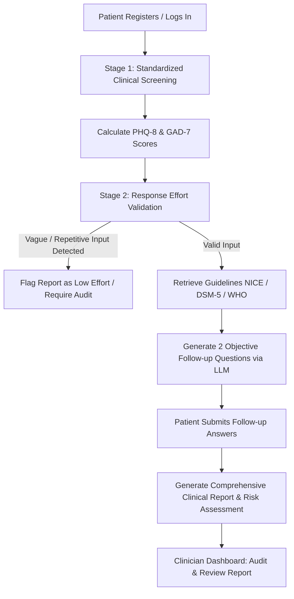

<p align="center">
  
</p>

<h1 align="center">Inner-Balance</h1>

<p align="center">
  <strong>"Reconnecting Minds, Restoring Balance."</strong>
</p>

---

## 📋 Overview

**Inner-Balance** is a cloud-native, clinical-grade digital mental health intake and pre-consultation assessment platform. It bridges the gap between static standardized patient intake forms and deep, personalized clinical interviews using **AI-powered adaptive questioning** and **Retrieval-Augmented Generation (RAG)** grounded in medical guidelines. 

The application utilizes a **Next.js** App Router frontend designed with a premium, focused dark-mode aesthetic and a **Django REST Framework** API backend. By leveraging the **Hugging Face Serverless Inference API** alongside a fallback local text-retrieval pipeline, the platform is optimized to run with high efficiency, low latency, and zero memory overhead—making it fully compatible with lightweight cloud services (like Render Free Tier).

---

## ⚙️ How It Works (Clinical Assessment Pipeline)

Inner-Balance operates via a structured, **two-stage adaptive intake workflow** built around safety and quality validation:



### 1. Stage 1: Standardized Clinical Scale Screening
The patient answers a series of validated clinical questionnaire prompts mapped to the:
* **PHQ-8 (Patient Health Questionnaire):** Measuring depression severity.
* **GAD-7 (Generalized Anxiety Disorder):** Measuring anxiety intensity.
* **Sleep & Functioning Scales:** Measuring somatic impacts on daily activities.

### 2. Clinical Response Effort Validation
Before generating diagnostic insights, the patient's open-ended answers are passed to a **Response Quality Validator**. The backend LLM parses responses to detect low-effort, repetitive, or off-topic inputs (e.g., `"blahh"`, `"paav bhaji"`). If the validation threshold fails:
* The intake report is flagged as **unreliable**.
* The clinician dashboard warns the doctor that a manual clinical audit is required.

### 3. Stage 2: RAG-Ground-Up Adaptive Questioning
The backend retrieves relevant clinical guidelines from **NICE (National Institute for Health and Care Excellence)**, **WHO mhGAP**, and **DSM-5** diagnostic criteria. 
* **Resource-Adaptive RAG:** The RAG system uses a hybrid vector store (ChromaDB) and file-system retrieval. In cloud environments where RAM is limited to 512MB, the system automatically falls back to parsing raw local guideline text files, providing identical high-quality clinical reference contexts to the prompt without any PyTorch or Chroma overhead.
* **Objective LLM Generation:** Constrained prompt guidelines prevent the LLM (`microsoft/Phi-3-mini-4k-instruct`) from offering therapeutic feedback or emotional validation. It maintains a strictly objective, symptom-focused clinical inquiry to generate exactly two follow-up questions inquiring about duration, triggers, or daily functioning impacts.

### 4. Clinician Insights Dashboard
Once submitted, the patient's data is compiled into a comprehensive summary report featuring risk levels (Low, Moderate, High, Crisis), diagnostic scores, and AI intake TL;DRs. Doctors can sign in to view, delete, or audit these reports.

---

## 🚀 Tech Stack

### **Backend (Django REST API)**
* **Django 4.2 & Django REST Framework** – API structure and user authentication.
* **SimpleJWT** – Secure token-based authentication.
* **dj-database-url** – Dynamic environment URL parsing for hosted databases.
* **LangChain & Hugging Face Serverless API** – Prompts orchestration and serverless LLM query pipeline.
* **Gunicorn** – High-performance production WSGI HTTP server.
* **PostgreSQL** – Production relational database.

### **Frontend (Next.js)**
* **Next.js 14+ (App Router)** – Performance-optimized client-side portal.
* **Vanilla CSS & Lucide Icons** – Tailored dark glassmorphic layout.
* **GSAP & Framer Motion** – Smooth micro-animations and page transitions.

---

## 🛠️ Build & Installation (Local Development)

### 1. Backend Setup (Django)
Navigate to the backend directory:
```bash
cd backend/innerbalance
```

Create and activate a virtual environment:
```bash
# Windows
python -m venv venv
venv\Scripts\activate

# macOS/Linux
python3 -m venv venv
source venv/bin/activate
```

Install python dependencies:
```bash
pip install -r requirements.txt
pip install dj-database-url
```

Configure your environment keys:
* Copy `.env.example` to `.env` (or let Django default to SQLite for local development).
* Add your Hugging Face credentials for API query testing:
  ```env
  HF_TOKEN=hf_your_token_here
  ```

Run migrations and start the Django server:
```bash
python manage.py migrate
python manage.py runserver
```
The API is available at `http://127.0.0.1:8000/`.

---

### 2. Frontend Setup (Next.js)
Open a new terminal window and navigate to the frontend directory:
```bash
cd Frontend/Inner-Balance/my-app
```

Install node packages:
```bash
npm install
```

Configure your local environment variables in a `.env.local` file:
```env
NEXT_PUBLIC_API_URL=http://127.0.0.1:8000
```

Start the Next.js development server:
```bash
npm run dev
```
Open your browser and navigate to `http://localhost:3000` to run the application locally.

---

## 🐳 Containerization & Deployment Configurations

### Local Multi-Container Run (Docker Compose)
The project includes a root [docker-compose.yml](file:///f:/InnerBalance/docker-compose.yml) orchestrating the Next.js portal, Django API, and a PostgreSQL database. To run the full stack locally in Docker:
```bash
docker compose up --build -d
```

### Cloud Production Deployment (Render)
The repository includes a [render.yaml](file:///f:/InnerBalance/render.yaml) blueprint config. To deploy the entire architecture for free:
1. Log in to **Render** and click **New +** -> **Blueprint**.
2. Connect your GitHub repository.
3. Set your custom `HF_TOKEN` and `DB_PASSWORD` variables when prompted.
4. Click **Apply**—Render will automatically configure, build, and link your services.
